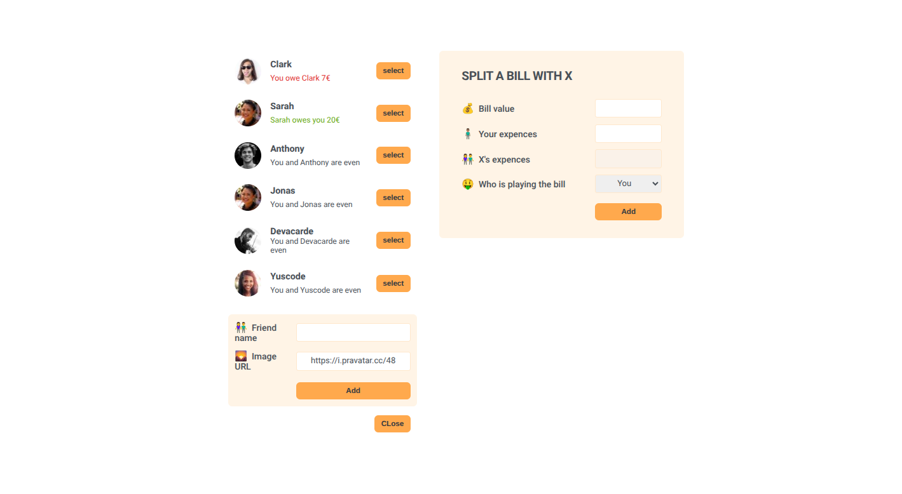

# 🍽️ Eat-N-Split

Eat-N-Split is a React-based app that helps friends keep track of shared expenses when dining together.  
Easily add friends, split bills, and track who owes what in a clean and intuitive interface.  

---

## ✨ Features

- 👥 **Add & Manage Friends** – Keep a list of friends you dine with.
- 💰 **Split Bills** – Enter bill amounts and split evenly or unevenly.
- 📊 **Track Balances** – See who owes you or who you owe.
- 🖥️ **Responsive UI** – Works seamlessly across devices.

---

## 🛠️ Tech Stack

- ⚛️ **React** – Frontend framework
- 🎨 **CSS** – Styling
- 🗂️ **useState** – State management

---
## 📸 Screenshots


---
## 🤝 Contributing
Contributions are welcome!
If you have ideas for improvements or new features, feel free to fork the repo and submit a pull request.

## 📦 Installation

```bash
# Clone the repository
git clone https://github.com/Abdulai059/Eat-n-split.git

# Navigate into the project folder
cd Eat-n-split

# Install dependencies
npm install

# Start the development server
npm run dev
